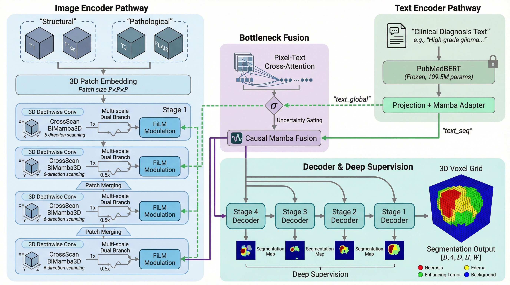

# TextMamba3D

[](./README_CN.md) | [](./README.md)


**A text-guided 3D brain tumor segmentation framework built on a unified Mamba architecture.** Achieves O(n) sequence complexity with ~60M trainable parameters (embed_dim=48, PubMedBERT last 2 layers unfrozen). Leverages clinical diagnostic text to guide volumetric MRI segmentation, validated on BraTS2020 TextBraTS dataset.



## Architecture Overview

The core data flow is kept clean in the architecture diagram. The following modules are implemented and annotated in code:

- `Modality Grouping`: `T1 + T1ce` / `T2 + FLAIR`
- Per-stage main block: `3D DWConv → CrossScan BiMamba3D` (multi-scale)
- Dual-path fusion: `FiLM + Pixel-Text Cross-Attention`
- `Uncertainty Gating` within CrossScan blocks to suppress high-uncertainty features
- `Deep Supervision` for multi-scale supervision in the decoder

<details>
<summary><b>ASCII Architecture Diagram (fallback)</b></summary>

```
    3D MRI Volume                                    Clinical Diagnostic Text
    (4ch: T1, T1ce, T2, FLAIR)                      "MRI shows left frontal lobe mass..."
             |                                                |
    [Modality Grouping]                            [PubMedBERT (partially frozen)]
  (T1+T1ce / T2+FLAIR)                                  ~109.5M params
             |                                                |
      [Patch Embed 3D]                             [Projection + Mamba]
             |                                                |
    +----------------------+                   text_global + text_seq
    | Encoder Stage 1..4   |<----- FiLM -------------+     |
    | 3D DWConv →          |                          |     |
    | CrossScan BiMamba3D  |<-- Pixel-Text Cross-Attn +     |
    | (multi-scale)        |                                |
    +----------+-----------+                                |
               |                                            |
       [Causal Mamba Fusion + Uncertainty Gating] <---------+
               |
     Decoder (symmetric + Skip + Deep Supervision)
               |
      [Final Expand + Conv3D]
               v
       Segmentation Output [B, 4, D, H, W]
       (background / necrotic / edema / enhancing)
```

</details>

## Key Features

- **Unified Mamba Architecture** — Encoder, text encoder, fusion, and decoder all built on State Space Models with lightweight Cross-Attention for cross-modal alignment. O(n) overall sequence complexity.

- **CrossScan BiMamba3D** — Bidirectional scanning along 3 spatial axes (6 directions total), providing complete volumetric context and resolving the information propagation blind spots of unidirectional SSMs.

- **PubMedBERT Text Encoder** — Partially frozen biomedical language model (~109.5M params), with last 2 layers unfrozen for task adaptation and a lightweight Mamba adapter layer (~18K extra params).

- **Multi-scale FiLM Fusion** — Text modulates image features via Feature-wise Linear Modulation across all 4 encoder stages, not just the bottleneck.

- **Causal Mamba Bottleneck Fusion** — Text tokens prepended to image tokens, leveraging Mamba's causal scan to naturally inject text context into image representations.

- **Robust Training (v2)** — Manual warmup + cosine LR schedule, gradient clipping (max_norm=1.0), NaN batch skip, bfloat16 AMP, class-weighted Dice + 3D Sobel edge loss + contrastive loss.

- **Pixel-Text Cross-Attention** — Fine-grained alignment between pixel tokens and text tokens for semantic guidance.

- **Uncertainty Gating** — Suppresses noisy region features within CrossScan BiMamba3D blocks.

- **Deep Supervision** — Multi-scale auxiliary losses at intermediate decoder stages.

## Quick Start

```bash
# Clone the repository
git clone https://github.com/PlutoLei/TextMamba3D.git
cd TextMamba3D

# Install dependencies
pip install -r requirements.txt

# Download PubMedBERT locally (~440MB)
python scripts/download_pubmedbert.py

# Quick test run (50 samples)
python train.py --config configs/textbrats.yaml --max-samples 50

# Evaluate
python evaluate.py --config configs/default.yaml --checkpoint checkpoints/best.pth
```

---

## Table of Contents

- [Environment Setup](#environment-setup)
- [Data Preparation](#data-preparation)
- [Model Weights](#model-weights)
- [Training](#training)
- [Evaluation](#evaluation)
- [Inference](#inference)
- [Architecture Details](#architecture-details)
- [Preliminary Results](#preliminary-results)
- [Project Structure](#project-structure)
- [Known Limitations](#known-limitations)
- [FAQ](#faq)
- [Citation](#citation)
- [Acknowledgments](#acknowledgments)
- [License](#license)

---

## Environment Setup

### System Requirements

| Item | Requirement |
|------|-------------|
| Python | >= 3.8 |
| CUDA | >= 11.8 (mamba-ssm requires CUDA compilation) |
| GPU VRAM | >= 8GB (12GB+ recommended) |
| OS | Linux / WSL2 (Windows native does not support mamba-ssm) |

### Quick Install

```bash
pip install -r requirements.txt
```

<details>
<summary><b>Full Setup (from scratch)</b></summary>

```bash
# Create virtual environment
python -m venv venv
source venv/bin/activate  # Linux / WSL2

# Install PyTorch (choose by CUDA version)
# CUDA 11.8
pip install torch torchvision torchaudio --index-url https://download.pytorch.org/whl/cu118
# CUDA 12.1
pip install torch torchvision torchaudio --index-url https://download.pytorch.org/whl/cu121

# Install Mamba SSM (requires CUDA toolchain)
pip install mamba-ssm

# Install remaining dependencies
pip install monai nibabel numpy scipy transformers pyyaml tensorboard tqdm einops pytest

# Verify installation
python scripts/verify_installation.py
```

</details>

---

## Data Preparation

### TextBraTS Dataset (Recommended)

TextBraTS provides expert-written clinical descriptions for each case, avoiding the information leakage problem of auto-generated text from segmentation masks.

- Source: [Kaggle BraTS2020](https://www.kaggle.com/datasets/awsaf49/brats20-dataset-training-validation) + [HuggingFace TextBraTS](https://huggingface.co/datasets/Jupitern52/TextBraTS)
- 369 total cases, split into **220 train / 55 val / 94 test** (following the original TextBraTS paper)

```
data/BraTS2020/BraTS2020_TrainingData/MICCAI_BraTS2020_TrainingData/
├── BraTS20_Training_001/
│   ├── BraTS20_Training_001_t1.nii(.gz)
│   ├── BraTS20_Training_001_t1ce.nii(.gz)
│   ├── BraTS20_Training_001_t2.nii(.gz)
│   ├── BraTS20_Training_001_flair.nii(.gz)
│   ├── BraTS20_Training_001_seg.nii(.gz)
│   └── BraTS20_Training_001_flair_text.txt   # Expert text
└── ...
```

Preprocessing is automatic: 4-modality stacking, Z-score normalization (non-zero voxels only), random/center cropping.

<details>
<summary><b>Alternative: BraTS 2021</b></summary>

Download from [Synapse](https://www.synapse.org/#!Synapse:syn25829067) or [Kaggle](https://www.kaggle.com/datasets/dschettler8845/brats-2021-task1).

```bash
python train.py --config configs/default.yaml
```

</details>

---

## Model Weights

The text encoder uses [PubMedBERT](https://huggingface.co/microsoft/BiomedNLP-PubMedBERT-base-uncased-abstract-fulltext) (~440MB). Download before training:

```bash
python scripts/download_pubmedbert.py
```

Saved to `./pretrained/pubmedbert/`. Set `text_model_path: null` in config to download from HuggingFace automatically if your environment has internet access.

---

## Training

### v2 Training Configuration

| Parameter | Value | Notes |
|-----------|-------|-------|
| embed_dim | 48 | Reduced from 96 for better param/sample ratio |
| Learning rate | 5e-5 | Manual warmup (10 epochs) + cosine decay |
| Weight decay | 0.01 | Standard AdamW regularization |
| Epochs | 300 | With patience=50 early stopping |
| Gradient clipping | max_norm=1.0 | Prevents gradient explosion |
| AMP | bfloat16 | No GradScaler needed |
| Gradient accumulation | 4 | Effective batch size = 4 |
| Split | 220/55/94 | train/val/test (original paper split) |

### Basic Training

```bash
python train.py --config configs/textbrats.yaml
```

### Quick Test (limited samples)

```bash
python train.py --config configs/textbrats.yaml --max-samples 50
```

### Resume Training

```bash
python train.py --config configs/textbrats.yaml --resume checkpoints/last.pth
```

### View Training Curves

```bash
tensorboard --logdir logs
```

<details>
<summary><b>Command-line Arguments</b></summary>

| Argument | Default | Description |
|----------|---------|-------------|
| `--config` | `configs/default.yaml` | Config file path |
| `--resume` | None | Resume from checkpoint |
| `--no-amp` | False | Disable mixed precision |
| `--no-text-ratio` | 0.1 | Fraction of text-free training samples |
| `--grad-accum` | 4 | Gradient accumulation steps |
| `--max-samples` | None | Limit training samples (for debugging) |

</details>

<details>
<summary><b>GPU VRAM Guide</b></summary>

| GPU VRAM | Recommended Config |
|----------|--------------------|
| 8 GB | `batch_size=1`, `patch_size=[64,64,64]`, `grad_accum=4`, AMP on |
| 12 GB | `batch_size=1`, `patch_size=[96,96,96]`, `grad_accum=4`, AMP on |
| 24 GB | `batch_size=2`, `patch_size=[96,96,96]`, `grad_accum=2`, AMP on |

Gradient checkpointing is on by default (`gradient_checkpointing: true`), saving ~30-50% VRAM with ~20% speed overhead.

</details>

---

## Evaluation

```bash
python evaluate.py --config configs/default.yaml --checkpoint checkpoints/best.pth
```

Reports standard BraTS three-region metrics:

| Region | Definition |
|--------|------------|
| ET (Enhancing Tumor) | Enhancing tumor (class 3) |
| TC (Tumor Core) | Necrotic + enhancing (class 1 + 3) |
| WT (Whole Tumor) | All tumor classes (class 1 + 2 + 3) |

Metrics: Dice Score (higher is better) and HD95 Hausdorff Distance (lower is better).

---

## Inference

### Single Case

```bash
python inference.py \
    --checkpoint checkpoints/best.pth \
    --input /path/to/BraTS20_Training_001 \
    --tta
```

### Batch Inference

```bash
python inference.py \
    --checkpoint checkpoints/best.pth \
    --input /path/to/cases_dir \
    --batch \
    --output ./predictions
```

### Custom Text Guidance

```bash
python inference.py \
    --checkpoint checkpoints/best.pth \
    --input /path/to/case \
    --text "MRI shows left frontal lobe mass with enhancing component"
```

Outputs NIfTI-format segmentation results with preserved affine matrices.

---

## Architecture Details

### Component Overview

| Component | Module | Params | Key Design |
|-----------|--------|--------|------------|
| Modality Grouping + Patch Embed | PatchEmbed3D | ~0.5M | `T1+T1ce` / `T2+FLAIR` physical grouping |
| Image Backbone | (3D DWConv → CrossScanBiMamba3D) ×4 | ~12M | Per-stage local conv + multi-scale 6-dir scan |
| Text Encoder | PubMedBERT + Projection + MambaLayer | ~110M (109.5M frozen) | Global/sequential dual text representations |
| Cross-modal Fusion | MultiScaleFiLM + PixelTextCrossAttention | ~2M | Stage-level modulation + pixel-text alignment |
| Uncertainty Gating | UncertaintyGating | ~0.3M | Suppress noisy region features |
| Decoder + Supervision | Decoder ×4 + Deep Supervision Heads | ~5M | Symmetric decoding + multi-scale auxiliary outputs |
| **Total** | | **~130M** | With PubMedBERT |
| **Trainable** | | **~60M** | PubMedBERT frozen + last 2 layers unfrozen |

### CrossScan BiMamba3D

Each encoder stage uses `3D DWConv → CrossScan BiMamba3D`: local texture extraction followed by global sequence modeling. CrossScan provides complete 3D context via tri-axial bidirectional scanning:

1. **D-H-W** (depth-first): forward + reverse
2. **H-W-D** (height-first): forward + reverse
3. **W-D-H** (width-first): forward + reverse

Outputs from 6 directions are aggregated through multi-scale branches.

### Dual-path Fusion

1. **Multi-scale FiLM**: Text global features modulate image features across all 4 encoder stages via `output = gamma * features + beta`.
2. **Pixel-Text Cross-Attention**: Fine-grained pixel-text alignment complementing FiLM's global modulation.
3. **Uncertainty Gating**: Uncertainty-based gating within CrossScan blocks to reduce noisy feature aggregation.
4. **Causal Mamba Fusion**: At the bottleneck, text tokens are prepended to image tokens, leveraging causal scanning to inject text context.

### Loss Function

```
L_total = L_main + λ_ds * L_deep_supervision + L_edge + λ_c * L_contrastive
L_main  = L_dice + L_ce

- L_dice:             Class-weighted Dice (weights: [0.25, 3.0, 1.0, 4.0])
- L_ce:               Class-weighted cross-entropy
- L_deep_supervision: Multi-scale auxiliary output supervision
- L_edge:             3D Sobel edge-weighted penalty for boundary clarity
- L_contrastive:      Bidirectional image-text alignment (active when batch_size > 1)
```

### Reproducibility

| Item | Setting |
|------|---------|
| Dataset | BraTS2020 TextBraTS |
| Samples & Split | 369 cases: 220 train / 55 val / 94 test |
| Random Seed | 42 |
| Hardware | RTX 4060 Laptop 8GB (WSL2) |
| Input Patch | 64³ |
| Batch Size | 1 |
| Gradient Accumulation | 4 |
| Training Acceleration | bfloat16 AMP + Gradient Checkpointing |
| Status | Training in progress (v2, 300 epochs) |

---

## Preliminary Results

> **Note**: The model is currently training. Results below are preliminary and do not represent final performance.

Results will be updated upon training completion.

---

## Project Structure

```
TextMamba3D/
├── configs/
│   ├── default.yaml              # BraTS2021 config (96³ patch)
│   └── textbrats.yaml            # TextBraTS config (64³ patch, v2 optimized)
├── data/
│   ├── brats_dataset.py          # BraTS2021 dataloader
│   ├── brats_textbrats_dataset.py # TextBraTS dataloader (3-way split)
│   ├── text_generator.py         # Auto-generate diagnostic text from masks
│   └── transforms.py             # 3D augmentation (crop/flip/elastic/noise)
├── models/
│   ├── mamba_block.py            # MambaBlock, BiMamba, CrossScanBiMamba3D
│   ├── encoder_3d.py             # PatchEmbed3D, PatchMerging3D, MambaEncoder3D
│   ├── text_encoder.py           # PubMedBERT + Mamba text encoder
│   ├── fusion.py                 # FiLM, MultiScaleFiLM, MambaFusion
│   ├── decoder_3d.py             # PatchExpanding3D, MambaDecoder3D
│   └── textmamba3d.py            # TextMamba3D main model
├── losses/
│   ├── dice_loss.py              # Class-weighted Dice loss
│   ├── edge_loss.py              # 3D Sobel edge loss
│   ├── contrastive_loss.py       # Bidirectional contrastive loss
│   └── __init__.py               # CombinedLoss
├── utils/
│   ├── metrics.py                # Dice, HD95 (BraTS region metrics)
│   ├── tta.py                    # Test-time augmentation
│   └── sliding_window.py         # Gaussian-weighted sliding window
├── tests/                        # 214 tests across 7 test files
├── scripts/
│   ├── download_pubmedbert.py    # PubMedBERT download script
│   ├── prepare_brats.py          # Data preprocessing script
│   └── verify_installation.py    # Installation verification
├── train.py                      # Training (bfloat16 AMP + grad clipping + manual LR)
├── evaluate.py                   # Evaluation (BraTS region metrics + TTA)
├── inference.py                  # Inference (sliding window + TTA + custom text)
├── smoke_test.py                 # End-to-end smoke test
├── requirements.txt
├── LICENSE
└── README.md
```

---

## Known Limitations

- Currently validated only on BraTS2020 TextBraTS; cross-dataset generalization tests pending.
- Training set limited to 220 cases.
- Text input depends on manually written clinical descriptions; text quality and writing style affect guidance effectiveness.
- mamba-ssm requires Linux/WSL2; Windows native is not supported.

---

## FAQ

<details>
<summary><b>WSL2 cannot connect to HuggingFace / network issues</b></summary>

WSL2 networking may block HuggingFace downloads. Workaround:

1. Run the download script on Windows (where networking works):
   ```bash
   cd TextMamba3D
   python scripts/download_pubmedbert.py
   ```
2. WSL2 reads local files via `/mnt/e/...` — no internet needed.

To fix WSL2 networking directly:
```bash
cat /etc/resolv.conf
sudo sh -c 'echo "nameserver 8.8.8.8" > /etc/resolv.conf'
```

</details>

<details>
<summary><b>mamba-ssm installation fails</b></summary>

mamba-ssm requires CUDA toolchain. Verify:

```bash
nvcc --version   # Need CUDA 11.8+
```

Try building from source:
```bash
pip install mamba-ssm --no-build-isolation
```

**Note:** Windows native does not support mamba-ssm. Use Linux or WSL2.

</details>

<details>
<summary><b>Out of memory (OOM)</b></summary>

1. Reduce `patch_size`: 96 → 64 (in config YAML)
2. Ensure `gradient_checkpointing: true` (on by default)
3. Increase accumulation: `--grad-accum 8`
4. Ensure AMP is enabled (on by default; `--no-amp` disables it)

</details>

<details>
<summary><b>ImportError: GreedySearchDecoderOnlyOutput</b></summary>

Caused by too-new transformers version. Downgrade:

```bash
pip install transformers==4.38.0
```

</details>

<details>
<summary><b>Training hangs at start</b></summary>

Mamba CUDA kernels are JIT-compiled on first run, typically taking 1-2 minutes. Training resumes automatically.

</details>

---

## Citation

If this project helps your research, please cite:

```bibtex
@article{textmamba3d2026,
  title={TextMamba3D: Text-Guided 3D Medical Image Segmentation with Unified State Space Models},
  author={Lei, Yuxuan},
  journal={arXiv preprint},
  year={2026}
}
```

---

## Acknowledgments

This project builds on the following works:

- [Mamba](https://github.com/state-spaces/mamba) — State Space Model architecture
- [U-Mamba](https://github.com/bowang-lab/U-Mamba) — Mamba for medical image segmentation
- [PubMedBERT](https://huggingface.co/microsoft/BiomedNLP-PubMedBERT-base-uncased-abstract-fulltext) — Biomedical language model
- [BraTS 2020](https://www.synapse.org/#!Synapse:syn25829067) — Brain Tumor Segmentation Challenge
- [TextBraTS](https://huggingface.co/datasets/Jupitern52/TextBraTS) — Text-guided brain tumor segmentation (MICCAI 2024)
- [MONAI](https://monai.io/) — Medical Open Network for AI

---

## License

This project is licensed under the [Apache License 2.0](LICENSE).
